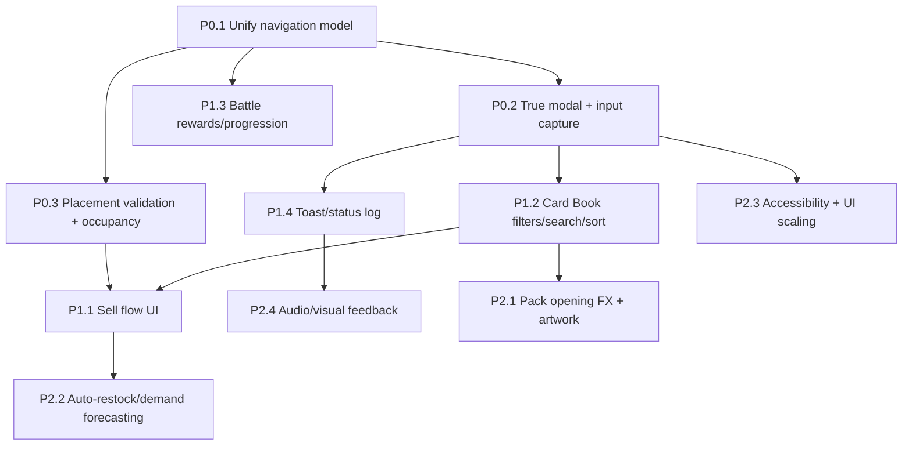

## Dev Plan (grounded backlog + PR plan)

This plan is based on a scan of:
- `README.md` **Not Implemented / Incomplete**
- `UI.md` **UI Roadmap**
- Codebase sweep for `TODO`/`FIXME` (none found) and obvious stubs/errors
- Current module structure: `game/core/*`, `game/scenes/*`, `game/ui/*`, `game/sim/*`, `game/cards/*`

### Current architecture snapshot (what actually runs)

- **App + state**: `game/core/app.py`
  - Owns the main loop, `GameState`, save/load, and a `scenes` dict.
  - Delivers pending inventory orders in real time via `process_pending_orders()`.
- **Scenes**: `game/scenes/*`
  - `MenuScene` (slot selection, “Recent updates”): `game/scenes/menu.py`
  - `ShopScene` (unified, single-screen tabs + draggable/resizable panels + shop-as-window): `game/scenes/shop_scene.py`
  - Legacy/separate scenes still exist and are wired in `GameApp._build_scenes()`:
    - `ManageScene`, `PackOpenScene`, `DeckBuildScene`, `BattleScene`, `ResultsScene`
- **Base scene UI**: `game/core/scene.py`
  - Wrapped top bar tabs (`Scene.TABS`) and **global Start/Stop Day** buttons (bottom-middle).
  - `on_enter()` / `on_exit()` are intentionally empty stubs (`pass`).
- **UI widgets**: `game/ui/widgets.py`
  - Minimal immediate-mode widgets: `Button`, `Panel`, `ScrollList`.
  - Tooltips are centralized/cached in `game/ui/tooltip_manager.py` and integrated via `game/core/scene.py`.
- **Shop sim model**: `game/sim/shop.py`
  - `ShopLayout` stores `objects` and `shelf_stocks`; placement prevents same-tile overlap only.
- **Economy**: `game/sim/economy.py`
  - Simple customer count + purchase choice weighted by prices.
- **Inventory**: `game/sim/inventory.py`
  - Stores boosters/decks/singles-by-rarity + applies `InventoryOrder`.
- **Cards**: `game/cards/*`
  - `CardCollection` stores owned cards and provides `entries(rarity=...)`.
  - `Deck` enforces 20-card validity and copy limits (covered by `game/tests.py`).

### Repo scan results (TODO/FIXME + “obvious” issues)

- **TODO/FIXME comments**: none found in `*.py`.
- **Stubbed methods**:
  - `Scene.on_enter()` / `Scene.on_exit()` are `pass` (expected extension points).
- **Swallowed exceptions**:
  - `SaveManager.set_slot_name()` catches exceptions and `pass`es (safe but hides errors).
- **Inconsistent “unified UI” direction**:
  - `ShopScene` implements the unified single-screen experience, but `GameApp` still wires separate scenes (`ManageScene`, `PackOpenScene`, `DeckBuildScene`, etc.) and `Scene.TABS` still points to those keys.
  - This creates two competing navigation models: “unified tabs inside `ShopScene`” vs “switch whole scenes.”
- **Small correctness/UX nits worth tracking** (not necessarily urgent):
  - `DeckBuildScene._refresh_lists()` calls `collection.entries(None if ... else None)` (effectively always `entries(None)`) and filters manually afterward.
  - `PackOpenScene` renders some bottom-of-card text at the same vertical anchor (potential overlap).
  - `CardCollection.revision` exists but isn’t updated on `add/remove` (if anything relies on it for caching, it’s currently ineffective).

---

## 1) Prioritized backlog (P0 / P1 / P2)

### P0 (ship-stoppers / foundation)

- **P0.1 Unify navigation model (single-source-of-truth UI)**
  - **Problem**: Two UI systems exist:
    - Unified tabs + panels in `game/scenes/shop_scene.py`
    - Scene switching via `game/core/scene.py` + `GameApp.switch_scene()`
  - **Impact**: Users can end up in legacy scenes that don’t match the unified UI expectations and may drift feature-wise.
  - **Where**: `game/core/app.py`, `game/core/scene.py`, `game/scenes/shop_scene.py`, legacy scene files.

- **P0.2 “True modal” system + input capture guarantees**
  - **Problem**: The project currently relies on local “early returns” for input capture (good start), but there’s no reusable, centralized modal stack.
  - **Impact**: Prevents regressions like “clicking one panel also triggers a button behind it” as windowed panels overlap.
  - **Where**: `game/ui/widgets.py` (or new `game/ui/modal.py`), `ShopScene.handle_event()`.
  - **Directly aligned with UI.md roadmap**: “True modal system”.

- **P0.3 Placement validation & occupancy rules**
  - **Problem**: `ShopLayout.place()` only prevents same-tile overlap; README calls out “Placement rules / collision constraints” as incomplete.
  - **Impact**: Needed before multi-tile objects, pathing constraints, “blocked tiles,” or future expansion.
  - **Where**: `game/sim/shop.py`, placement interactions in `ShopScene`.

### P1 (high value features)

- **P1.1 Sell flow UI (buylist/retail, confirmations, receipts)**
  - **Problem**: README explicitly lists sell flow as incomplete.
  - **Where**: `ShopScene` manage tab UI, `Inventory` + `CardCollection`, shelf listing system (`ShopLayout.shelf_stocks`).

- **P1.2 Card Book filters/sorting/search**
  - **Problem**: README + UI.md roadmap both call out collection filters/search/sort.
  - **Where**: Card book view in `ShopScene` (and any shared “card picker” view), `CardCollection.entries()`.

- **P1.3 Battle rewards + progression loop**
  - **Current**: `BattleScene._finish_battle()` awards `+$15` and `+1 pack`, then saves and shows `ResultsScene`.
  - **Missing**: Longer progression (scaling rewards, unlocks, shop progression hooks).
  - **Where**: `game/scenes/battle_scene.py`, `game/scenes/results_scene.py`, `game/core/app.py` state if progression is stored.

- **P1.4 Toast/status log**
  - **Problem**: UI.md roadmap calls out toast/log; README calls out “Audio/visual feedback”.
  - **Where**: New widget/module in `game/ui/*`, fed by direct calls or `EventBus` (`game/core/events.py`).

### P2 (polish / longer-horizon)

- **P2.1 Pack opening FX + pack artwork**
  - **Where**: Pack UI in `ShopScene` and/or `PackOpenScene`; assets in `game/assets/*`.

- **P2.2 Auto-restock / demand forecasting**
  - **Status**: partial (a roaming staff actor exists; demand forecasting is still missing)
  - **Where**: `game/sim/actors.py` (staff state machine), `game/sim/economy.py` (demand), `ShopScene` manage automation UI

- **P2.3 Accessibility + UI scaling**
  - **Where**: `game/ui/theme.py` (fonts/colors), `game/config.py` (settings), global UI scaling.

- **P2.4 Audio/visual feedback**
  - **Where**: new audio module; note `main.py` sets SDL audio driver to dummy in WSL2 contexts.

---

## 2) Dependency graph (what must ship before what)

**Notes**
- If navigation remains split, every feature must be implemented twice (in `ShopScene` tabs and in legacy scenes) or risk drift.
- A modal stack simplifies *all* future overlapping windows (shop window + manage panes + card book + menus).

---

## 3) Proposed incremental PR plan (small, testable steps)

Each PR should be runnable via:
- **Static sanity**: `python -m compileall -q game`
- **Sanity tests**: `python -m game.tests`

### PR 1 — “Navigation consolidation”
- **Goal**: Ensure there is one canonical gameplay UI flow.
- **Change**:
  - Option A (recommended): Keep `MenuScene` as a separate scene, but make top tabs route to **`ShopScene` + internal tab switching**, not scene switching.
  - Option B: Remove legacy scenes from `Scene.TABS` and `GameApp._build_scenes()` (or keep them but unreachable).
- **Touched**: `game/core/scene.py`, `game/core/app.py`, `game/scenes/shop_scene.py` (add a method like `set_tab("manage"|"packs"|...)`).
- **Test plan**:
  - Manual: navigate to every tab, confirm Start/Stop day works, confirm no scene-jumps to legacy UI.
  - Automated: `python -m game.tests`.

### PR 2 — “Reusable modal stack + dimming overlay”
- **Goal**: Centralize modal behavior and prevent click-through regressions.
- **Change**:
  - Add a minimal modal manager (stack) in `game/ui/*`.
  - Update `ShopScene` to register menu modal + card-book modal through it.
- **Touched**: `game/ui/widgets.py` (or new `game/ui/modal.py`), `game/scenes/shop_scene.py`.
- **Test plan**:
  - Manual: open modal, click outside, ensure underlying buttons don’t fire; ESC closes.

### PR 3 — “Occupancy map + placement rules v1”
- **Goal**: Make placement constraints explicit and testable.
- **Change**:
  - Add an occupancy structure to `ShopLayout` (e.g., `set[tuple[int,int]]`) and enforce it on `place/remove_at`.
  - Add validation hooks for future multi-tile objects (even if only 1×1 today).
- **Touched**: `game/sim/shop.py`, placement interactions in `ShopScene`.
- **Tests**:
  - Extend `test_shop_no_overlap_place()` in `game/tests.py`.

### PR 4 — “Toast/status log”
- **Goal**: Immediate feedback for orders, deliveries, listings, purchases.
- **Change**:
  - Add `ToastLog` widget and render it consistently (likely via `Scene.draw()` so it’s global).
  - Emit events from order placement + delivery (`GameApp.process_pending_orders()`), and listing actions.
- **Touched**: `game/core/app.py`, `game/core/events.py` (optional), `game/ui/*`, `ShopScene`.
- **Test plan**:
  - Manual: place an order; after ~30s, toast appears on delivery.

### PR 5 — “Card Book filters/search/sort (shared component)”
- **Goal**: Make collection browsing scale; reuse in deck building and shelf listing.
- **Change**:
  - Implement filtering + sorting in one place (the ShopScene card-book view is the best canonical target).
  - If legacy `DeckBuildScene` remains, re-point it to the shared component or deprecate it.
- **Touched**: `game/scenes/shop_scene.py`, `game/cards/collection.py` (maybe add helpers), `game/ui/widgets.py` (text input if needed).

### PR 6 — “Sell flow UI v1”
- **Goal**: Minimal, complete sell loop with confirmations.
- **Change**:
  - Define sell actions: select card(s) → list on shelf → show expected revenue, fees/tax (if any), confirm.
  - Add “receipt”/summary via toast log.
- **Touched**: `ShopScene` manage tab, `ShopLayout.shelf_stocks`, `Inventory`/`CardCollection`.
- **Tests**:
  - Add small pure-logic tests for pricing calculations (keep UI thin).

### PR 7 — “Battle rewards/progression v1”
- **Goal**: Turn current fixed rewards into a progression-aware system.
- **Change**:
  - Add scaling rewards based on day or win streak.
  - Persist progression state in `GameState`.
- **Touched**: `game/core/app.py` (state), `battle_scene.py`, `results_scene.py`, save/load serialization.

### PR 8+ — P2 items (FX, forecasting, accessibility, audio)
- Split per feature area to avoid giant PRs.

